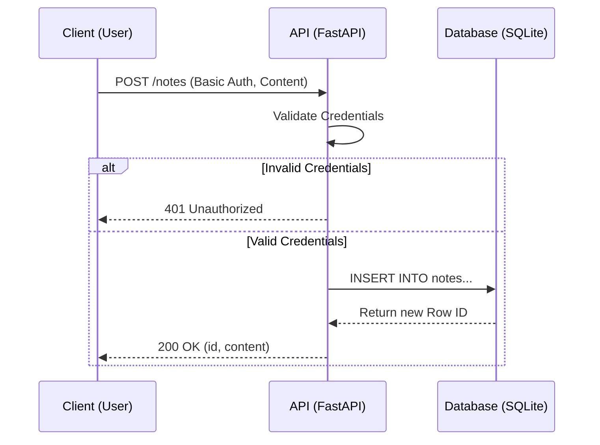
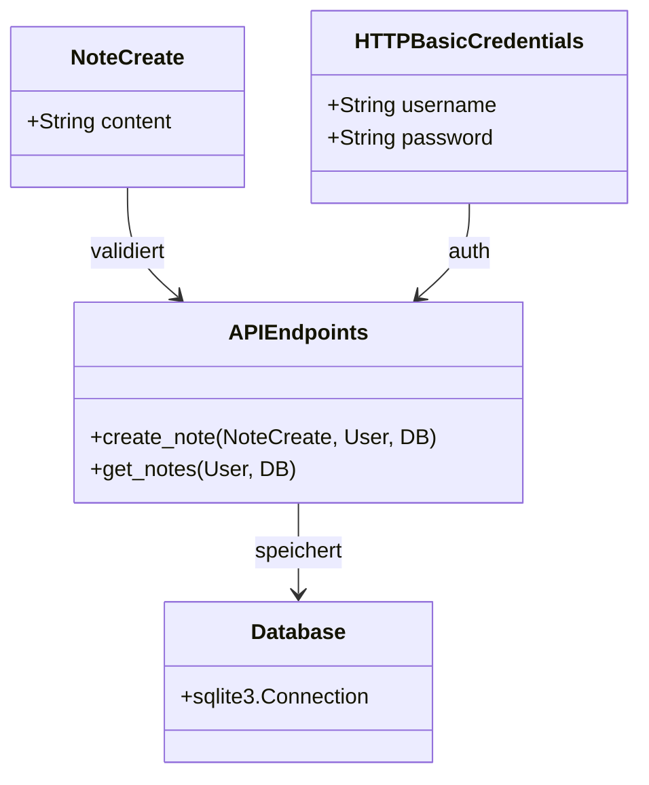

# UML Diagramme

## Use Case Diagramm
```mermaid
usecaseDiagram
    actor User
    usecase "Login / Authenticate" as UC1
    usecase "Create Note" as UC2
    usecase "Read Notes" as UC3

    User --> UC1
    User --> UC2
    User --> UC3
    UC2 ..> UC1 : include
    UC3 ..> UC1 : include
```

## Sequenzdiagramm: Notiz erstellen


## Klassendiagramm
