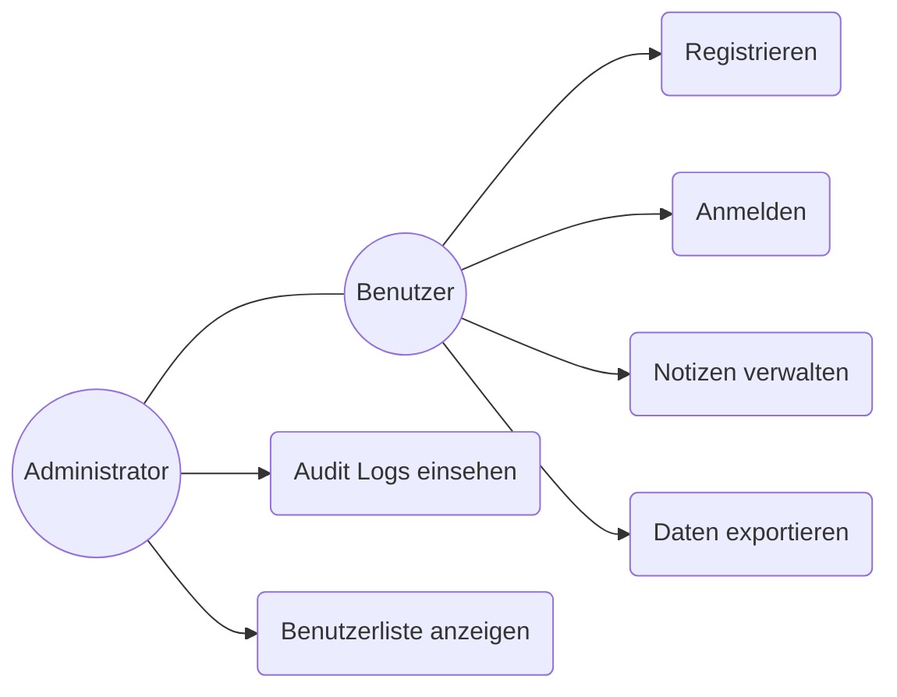
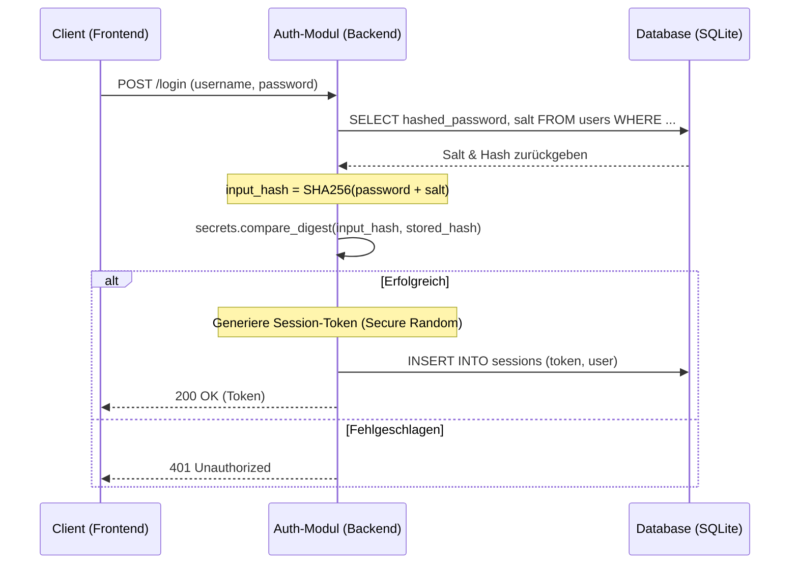
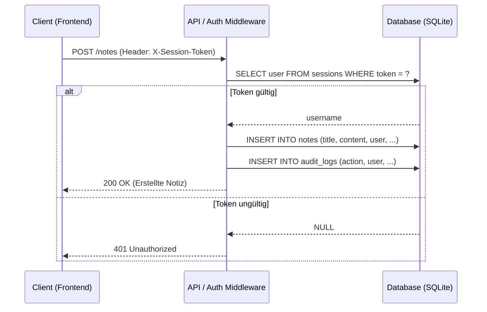
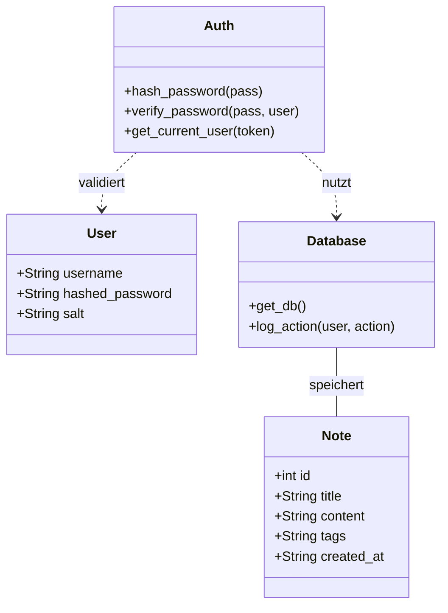

# UML Diagramme (Aktualisiert)

## Use Case Diagramm
Dieses Diagramm zeigt die Interaktionen der Benutzer (User/Admin) mit dem System.

## Sequenzdiagramm: Authentifizierung & Session (Login)
Detaillierter Ablauf des sicheren Logins mit Salted Hashing.

## Sequenzdiagramm: Authentifizierte Anfrage (z.B. Notiz erstellen)
Zeigt die Validierung des Session-Tokens bei jeder Anfrage.

## Klassendiagramm (Modular)
Struktur der Anwendung nach dem Refactoring.

